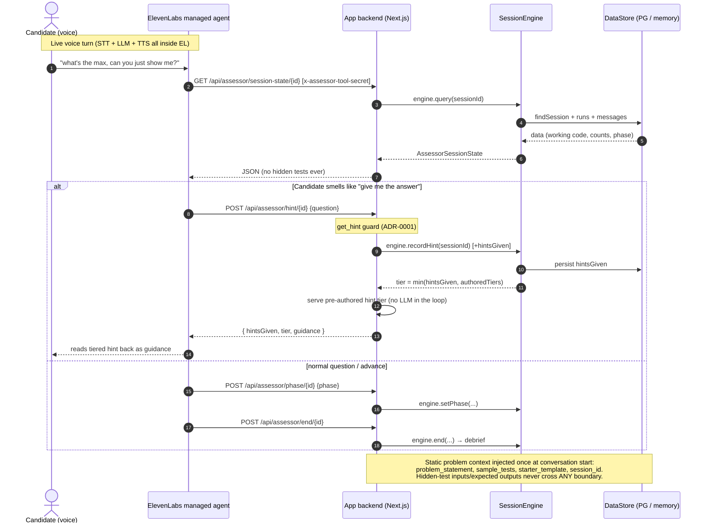
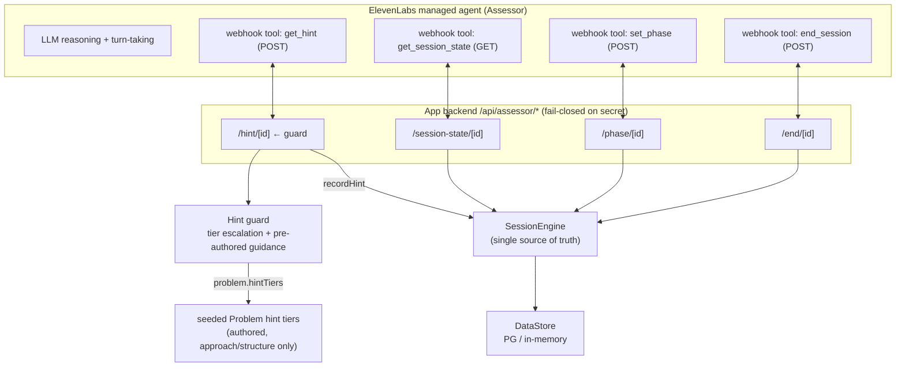

# Structural guard for hints — system view

How the current Assessor tool system works, with the `get_hint` guard (Ticket 8, ADR-0001) in place.

## Sequence diagram

## Component flow

## Key points

- **One seam**: every tool route is a thin adapter over `SessionEngine`, which owns all Session state including the new `hintsGiven` counter.
- **Guard is the only sanctioned answer path**: the agent routes "give me the answer" style asks into `get_hint`; the backend serves the Problem's pre-authored hint tier, escalating on a durable counter, and never sees hidden tests. The system prompt is backup, not the guarantee.
- **No LLM in the loop**: hint guidance is authored with each seeded Problem and served verbatim — the strongest structural guarantee, with nothing to jailbreak.
- **Fail-closed**: every tool call needs `x-assessor-tool-secret`; a Problem with no authored tiers still gets fixed, generic approach guidance rather than an unguarded answer.

To view: render the Mermaid blocks on GitHub, [mermaid.live](https://mermaid.live), or the *Markdown Preview Mermaid Support* VS Code extension.